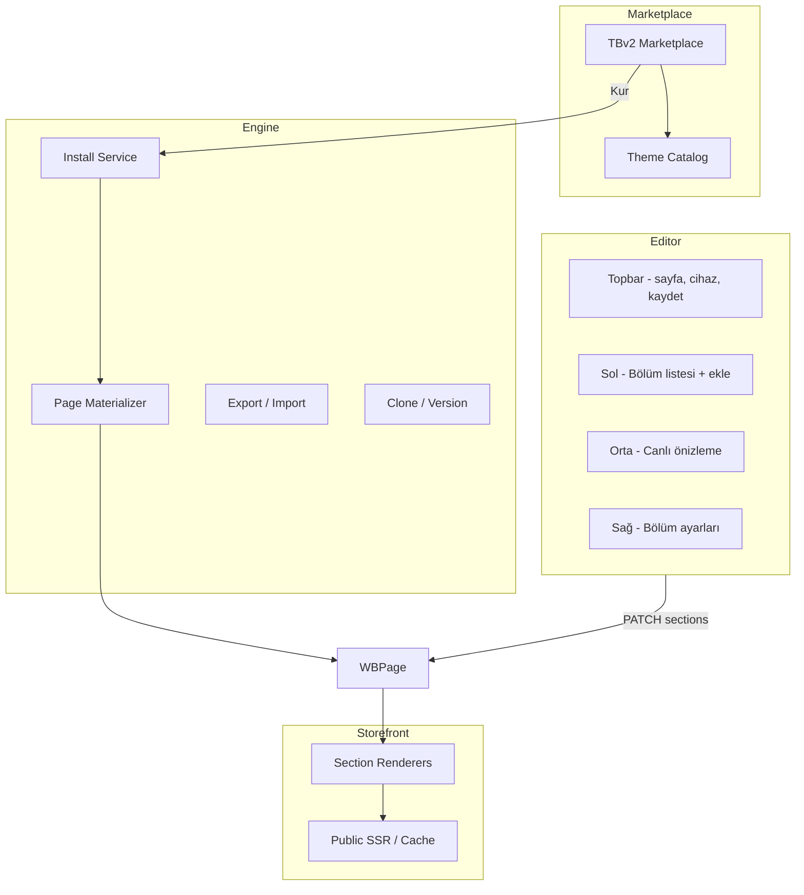

# LysiaETIC Theme Builder V2 — Mimari

> Referans ilham (lisans dışı, yapısal): [Shopify Dawn](https://github.com/Shopify/dawn), [Shopify Theme Store](https://themes.shopify.com/), Builder.io section/block modeli.

## 1. Mevcut durum analizi

| Alan | Durum | V2 kararı |
|------|--------|-----------|
| `WBPage.sections[]` | Section tabanlı, çalışıyor | **Korunur** — ana veri modeli |
| `section-registry.js` | 167 hazır bölüm | **Korunur** — Section Library |
| `ThemeEditorPage` (v5) | Shopify benzeri UX | **Tek editör** |
| `grapesEditor` / `puckEditor` | Karmaşık, kullanıcı kaybı | **Deprecated** |
| `oss-themes/*.json` | HTML kopyaları | **Kaldırılacak** (faz 2) |
| `WBTheme` / `WBThemeInstall` | Versiyonlu tema | **TBv2 ile birleşir** |
| Breakpoint | `mobileOverride` per section | **Genişletilir** (tablet) |

## 2. Veri hiyerarşisi (JSON / MongoDB)

```
ThemePack (TBv2ThemePack)
├── settings: { colors, typography, logo, header, footer }
├── pages[]
│   ├── templateKey: "home" | "product" | "collection" | ...
│   └── sections[]
│       ├── id, type, order
│       ├── settings: { spacing, colors, ... }
│       ├── content: { heading, ... }
│       ├── blocks[]          ← App Blocks (V2.1)
│       └── responsive
│           ├── desktop
│           ├── tablet
│           └── mobile
└── version, changelog

Site (WBSite.themeBuilderVersion = "v2")
└── TBv2ThemeInstall (site başına aktif paket + özelleştirmeler)
    └── WBPage[] (materialize edilmiş sayfalar)
```

## 3. Sistem diyagramı



## 4. Editör mimarisi (Shopify Online Store 2.0)

```
┌─────────────────────────────────────────────────────────────┐
│  Sayfa seç │ Cihaz │ Geri al │ Kaydet │ Önizle │ Yayınla    │
├──────────┬──────────────────────────────┬───────────────────┤
│ Üst Menü │                              │ Bölüm: Hero       │
│ ──────── │     Canlı mağaza önizleme    │ Başlık [____]     │
│ Hero  ◀  │     (tıkla = seç)            │ Görsel [yükse]    │
│ Ürünler  │                              │ Renk   [____]     │
│ Bülten   │                              │ Boşluk [slider]   │
│ Alt Menü │                              │                   │
│ + Bölüm  │                              │                   │
└──────────┴──────────────────────────────┴───────────────────┘
```

Teknik panel yok. GrapesJS / katman ağacı / CSS editörü kullanıcıya gösterilmez.

## 5. API (`/api/website-builder/tbv2/`)

| Method | Path | Açıklama |
|--------|------|----------|
| GET | `/catalog` | Tema paketleri |
| GET | `/sections` | Section library (167+) |
| GET | `/blocks` | Block library |
| POST | `/sites/:siteId/install` | Tema kur + tüm sayfalar |
| POST | `/sites/:siteId/clone` | Tema klonla |
| GET | `/sites/:siteId/export` | JSON export |
| POST | `/sites/:siteId/import` | JSON import |
| POST | `/sites/:siteId/ai/theme` | AI tema (beta) |
| POST | `/sites/:siteId/ai/section` | AI bölüm (beta) |

## 6. Hazır sayfalar (kurulum sonrası)

Her tema paketi şunları materialize eder:

- Anasayfa, Koleksiyon, Ürün, Sepet, Arama, Blog, Hesap, İstek listesi, Ödeme, İletişim, SSS, 404

## 7. Faz planı

| Faz | Kapsam | Durum |
|-----|--------|-------|
| **1** | TBv2 engine, catalog, install, Shopify editör, hub | **Tamamlandı (çekirdek)** |
| **2** | App Blocks, tablet breakpoint, design panel | Planlı |
| **3** | AI theme/section generator | Planlı |
| **4** | Eski grapes/oss temizliği | Planlı |

### Faz 1 — oluşturulan dosyalar

**Backend**
- `theme-builder-v2/presets/pageBuilders.js` — 12 sayfa şablonu
- `theme-builder-v2/catalog/theme-catalog.js` — 6 Lysia orijinal tema
- `theme-builder-v2/catalog/block-library.js` — 15 blok tipi
- `theme-builder-v2/services/tbv2ThemeEngine.js` — install / materialize / export / import / clone
- `controllers/tbv2Controller.js`, `routes/tbv2Routes.js`
- `models/TBv2ThemePack.js`, `models/TBv2ThemeInstall.js`
- `scripts/seed-tbv2-packs.js`

**Frontend**
- `services/tbv2Api.js`
- `components/storeBuilder/marketplace/ThemeBuilderV2Marketplace.js`
- Hub: `EcommerceWbChannelHub.js` → V2 marketplace

**API prefix:** `/api/website-builder/tbv2/...` ve `/api/website-builder/sites/:siteId/tbv2/...`

## 8. Performans & SEO

- Section lazy render, image CDN, page cache → `wbPublicService`
- SEO: `WBPage.seo` + schema → mevcut `ThemeEditorSeoModal`
